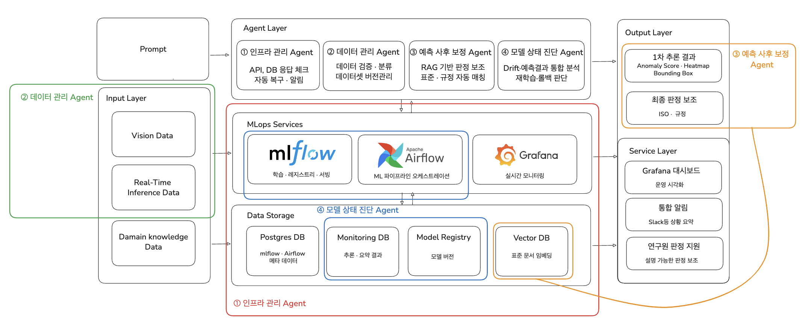

# dais_agent — 산업 비전 AI 자율 운영 플랫폼

> DaiS LAB 사이드 프로젝트.
> MLOps 환경 위에서 **4개 Agent 가 운영을 자율 관리** 하는 비전 AI 결함 탐지 플랫폼.



기존 MLOps 는 학습/배포 자동화에 머무는 한계가 있다.
운영 단계에서 발생하는 **상태 진단 · 원인 추론 · 재학습 판단 · 결과 해석** 은 여전히 사람이 수작업으로 처리한다.
본 프로젝트는 그 운영 단계를 Agent 기반으로 통합 고도화하여, 자율적으로 감지·해석·판단·연계하는 비전 AI 운영 체계를 만드는 것을 목표로 한다.

> 비즈니스 배경 / AS-IS·TO-BE / Agent 4종 상세는 [assets/Project_Introduction/Project introduction.md](assets/Project_Introduction/Project%20introduction.md) 참고.
> 협업 규칙은 [docs/CONTRIBUTING.md](docs/CONTRIBUTING.md), 자세한 파일 구조는 [docs/STRUCTURE.md](docs/STRUCTURE.md).
> **본 저장소의 사용/복제/배포는 [LICENSE](LICENSE) 의 제약을 받는다 (All Rights Reserved).**

---

## 1. 접속 URL

| 서비스 | URL | 용도 |
|---|---|---|
| MLflow | http://localhost:5000 | 모델 학습 / 등록 / Registry |
| Airflow | http://localhost:8080 | 파이프라인 (admin/admin 또는 .env 설정) |
| Grafana | http://localhost:3000 | 모니터링 대시보드 |
| Prometheus | http://localhost:9090 | 메트릭 수집 |
| MinIO Console | http://localhost:9001 | Artifact Storage |
| ml-inference | http://localhost:8004 | 결함 추론 FastAPI (`/health`, `/predict`) |
| **Web Dashboard** | http://localhost:8005 | **결함 탐지 웹 대시보드 (React + FastAPI)** — `/api/docs` Swagger UI |
| Data Agent | http://localhost:8001 | (Phase 7 작업 중) |
| Infra Agent | http://localhost:8002 | (Phase 7 작업 중) |
| Correction Agent | http://localhost:8003 | (Phase 7 작업 중) |

포트 전체 정리: [docs/PORTS.md](docs/PORTS.md)

---

## 2. 4 Agent 의 책임

| Agent | 한 줄 책임 |
|---|---|
| **인프라 관리** | MLOps 서비스 통합 헬스체크 / 장애 원인 분석 / 자동 복구 / 알림 |
| **데이터 관리** | 유입 데이터 자동 검증 · 라우팅 · 데이터셋 버전 관리 (모델-데이터 추적) |
| **사후 보정** | 추론 결과(heatmap/bbox) + 표준 문서 RAG 결합 → 설명 가능한 판정 보조 |
| **모델 성능 모니터링** | 복합 지표 기반 상태 진단 / 재학습 · 롤백 자동 판단 |

자세한 책임 · 입출력 명세: [docs/AGENTS.md](docs/AGENTS.md)
비즈니스 배경 · 현재 문제점: [assets/Project_Introduction/Project introduction.md](assets/Project_Introduction/Project%20introduction.md)

---

## 3. 핵심 결정사항

- 단일 Docker network `dais_network` — 모든 컨테이너가 한 네트워크에서 통신
- MLflow Artifact = **MinIO** (S3 호환) — 모델 / 산출물 버전 저장
- Postgres 인스턴스 1개 / DB 분리 (`mlflow_db`, `airflow_db`, `dais_data_db`) — 메타데이터
- 웹 대시보드용 이미지 스토리지 = MinIO bucket `dais-images` (MLflow artifact 와 분리)
- Agent 간 통신 **없음** — 각 Agent 는 독립 컨테이너 + 자체 진입점
- LangSmith 자동 tracing — `LANGCHAIN_*` 환경변수만 있으면 모든 LLM 호출 추적

상세 결정 배경은 [docs/ARCHITECTURE.md](docs/ARCHITECTURE.md) "2. 핵심 결정사항" 참고.

---

## 4. 사전 요구사항

- Docker 24+ / docker compose v2 plugin
- NVIDIA Container Toolkit (GPU 학습/추론에 필요)
- 외부 LLM endpoint — OpenAI 호환 (vLLM). 서빙 정의는 [docker/llm-qwen/](docker/llm-qwen/)
- Python 3.11+ (Agent 개발 / 호스트 venv 작업 시)
- GNU Make

---

## 5. 빠른 시작

### 5-1. 인프라 기동 (필수)

```bash
git clone git@github.com:Dais-lab/dais-agent-public.git dais_agent
cd dais_agent

make init        # .env 생성
# .env 파일을 열어 비밀번호 / API 키 / FERNET_KEY 및 HOST_* 경로 채우기
#   FERNET_KEY: python -c "from cryptography.fernet import Fernet; print(Fernet.generate_key().decode())"

# ⚠️ Model training 코드 (model/dinov3_anomaly/) 는 외부 보관 — ml-* 사용 전 배치 필수.
#    자세히: docs/EXTERNAL_CODE.md

make build       # 인프라 + Agent 이미지 빌드 (첫 회 5~10분)
make up          # 전체 스택 기동
make ps          # 모든 서비스 healthy 확인
```

> 신규 팀원은 먼저 [docs/GITHUB_ONBOARDING.md](docs/GITHUB_ONBOARDING.md) 의 SSH 키 / pre-commit 셋업을 1회 진행해야 한다.

이 단계만 끝나면 위 "1. 접속 URL" 의 5개 UI 가 모두 동작.

### 5-2. Agent 개발 환경 (Agent 로직 작업 시)

```bash
# uv 권장 (없으면 pip 도 가능)
uv venv
source .venv/bin/activate
uv pip install -e ".[dev]"

# LLM 연결 검증 (LangSmith trace 1건 생성)
pytest tests/integration/test_llm_connectivity.py -v -s -m integration
```

### 5-3. DINOv3 추론 (GPU 사용)

```bash
make ml-build               # GPU 이미지 빌드 (PyTorch 2.10 + CUDA 12.8)
make ml-register-existing   # 기존 학습된 .pth 를 MLflow Registry → Production 자동 승격
make ml-up                  # ml-inference (FastAPI :8004) 기동, 모델 startup 로드

# 단일 케이스 추론
curl -X POST http://localhost:8004/predict \
     -H 'Content-Type: application/json' \
     -d '{"case_id":"<case_id>"}'
```

학습부터 다시 돌리려면 `make ml-train`. 자세한 흐름: [docs/MLFLOW_WORKFLOW.md](docs/MLFLOW_WORKFLOW.md).

### 5-4. 웹 대시보드 (결함 탐지 UI)

```bash
make web-build              # multi-stage: Node 빌드 → Python FastAPI 정적 서빙
make web-up                 # http://localhost:8005 (원격 호스트면 http://<HOST>:8005)

# 기존 inbox 데이터를 DB + MinIO 에 등록 (최초 1회)
docker run --rm --network dais_network \
  -v "$(pwd):/app" \
  -v "${INBOX_DIR:?set INBOX_DIR in .env, e.g. /path/to/inbox}/20260507_test:/data:ro" \
  -w /app --env-file .env \
  -e SCRIPT_DB_HOST=postgres -e SCRIPT_MINIO_HOST=minio \
  ghcr.io/astral-sh/uv:python3.11-bookworm \
  uv run scripts/import_case.py --source-dir /data
```

- **대시보드 페이지**: 외부 서비스 링크 / KPI / 서비스 헬스 / 최근 케이스
- **결함 탐지 페이지**: 날짜별 케이스 목록 → 이미지 10장씩 → "결함 탐지 실행" → heatmap/annotation
- **모델 관리 / 모니터링**: 일부 영역 `예시` (추후 MLflow API / Prometheus 연동)
- ml-inference 미가동 시 mock fallback 으로 UI 흐름 검증 가능 (`ML_INFERENCE_MOCK_ON_FAILURE=true`)

DB 스키마 / MinIO key 규칙: [docs/IMAGE_STORAGE_REPORT.md](docs/IMAGE_STORAGE_REPORT.md)

---

## 6. 파일 구조

```
dais_agent/
├── docker/      # MLOps 인프라 정의 (compose, Dockerfile, 각 서비스 설정)
├── model/       # DINOv3 anomaly 학습/추론 코드 + weights (gitignore)
├── agents/      # 4개 Agent — LangChain/LangGraph (Phase 7 작업 중)
├── web/         # 웹 대시보드 (FastAPI 백엔드 + Vite React 프론트, multi-stage Dockerfile)
├── data/        # 학습 / 검증 / 추론 데이터 (gitignore, README/구조만 추적)
├── docs/        # 아키텍처 · 포트 · 워크플로 문서
├── tests/       # 단위 + 통합 테스트
├── scripts/     # 운영 헬퍼 스크립트 (import_case.py, init_data_db_schema.sql 등)
└── assets/      # 프로젝트 소개 자료 · 다이어그램
```

자세한 자식 트리는 [docs/STRUCTURE.md](docs/STRUCTURE.md) 참고.

---

## 7. 문서 인덱스

| 문서 | 내용 |
|---|---|
| [docs/GITHUB_ONBOARDING.md](docs/GITHUB_ONBOARDING.md) | **신규 팀원 첫 협업 가이드** (SSH/clone/PR/pre-commit) |
| [docs/EXTERNAL_CODE.md](docs/EXTERNAL_CODE.md) | **Model training 코드 받기 / 배치 가이드** (ml-* 사용 전 필수) |
| [assets/Project_Introduction/](assets/Project_Introduction/Project%20introduction.md) | 비즈니스 배경 / AS-IS·TO-BE / 4 Agent 상세 |
| [docs/ARCHITECTURE.md](docs/ARCHITECTURE.md) | 시스템 다이어그램 / 데이터 흐름 / 핵심 결정사항 |
| [docs/STRUCTURE.md](docs/STRUCTURE.md) | 자세한 파일 구조 / 분리 원칙 / git 추적 정책 |
| [docs/CONTRIBUTING.md](docs/CONTRIBUTING.md) | 협업 규칙 / Git Flow 워크플로 / PR 가이드 |
| [docs/PORTS.md](docs/PORTS.md) | 포트 할당 표 / 충돌 회피 규칙 |
| [docs/SETUP.md](docs/SETUP.md) | 상세 설치 / 트러블슈팅 |
| [docs/MLFLOW_WORKFLOW.md](docs/MLFLOW_WORKFLOW.md) | 학습 → 등록 → 배포 흐름 (DINOv3 기준) |
| [docs/AGENTS.md](docs/AGENTS.md) | 각 Agent 책임 / 입출력 / 활용 자원 |
| [docs/IMAGE_STORAGE_REPORT.md](docs/IMAGE_STORAGE_REPORT.md) | 웹 대시보드 DB 설계 (Postgres + MinIO) / 추론 결과 스키마 |
| [agents/README.md](agents/README.md) | Agent 개발 온보딩 가이드 (팀원용) |
| [data/README.md](data/README.md) | 데이터 폴더 컨벤션 / 추론 결과 스키마 |

---

## 8. 자주 쓰는 명령

```bash
make help                                # 전체 명령 목록
make up / down / ps / logs               # 인프라
make build                               # 인프라 + Agent 이미지 재빌드
make ml-build / ml-up / ml-down          # GPU 컨테이너
make ml-register-existing                # 기존 .pth → MLflow Registry + Production 승격
make ml-predict CASE=<case_id>           # 단발 추론 (CLI)
make web-build / web-up / web-down       # 웹 대시보드 (:8005)
make web-logs / web-restart              # 웹 로그 / 재기동
make ml-shell / airflow-shell / psql     # 디버깅 진입
make clean                               # 컨테이너 + 볼륨 모두 삭제 (데이터 손실, 주의)
```

---

## 9. 협업 규칙 (요약)

- 결정 변경 시 **문서 우선 갱신** ([docs/ARCHITECTURE.md](docs/ARCHITECTURE.md)) → 코드 변경
- 포트 추가/변경 시 [docs/PORTS.md](docs/PORTS.md) 동시 갱신
- 새 환경변수는 반드시 `.env.example` 에 같이 추가 (`.env` 절대 커밋 금지)
- 브랜치 명명: `<type>/<scope>-<설명>` (예: `feat/data-agent-validate`)
- 의존성 변경된 PR 머지 후: `git pull && uv sync && make build && make up`

전체 규칙 / git 워크플로 / PR 템플릿: [docs/CONTRIBUTING.md](docs/CONTRIBUTING.md)

---

## 10. 진행 상황

**인프라 + Agent 환경 + DINOv3 anomaly detection + 웹 대시보드(:8005) 통합** 완료.
현재 **Agent 로직 구현** 작업 중. 새 합류자는 [agents/README.md](agents/README.md) 부터 읽기 권장.

웹 대시보드의 결함 탐지 흐름(케이스 목록 → 이미지 그리드 → 탐지 실행 → heatmap/annotation 표시)이 동작 한다. 실제 추론은 GPU + MLflow Production 모델 필요. 미가동 시 mock fallback 으로 UI 검증 가능.
