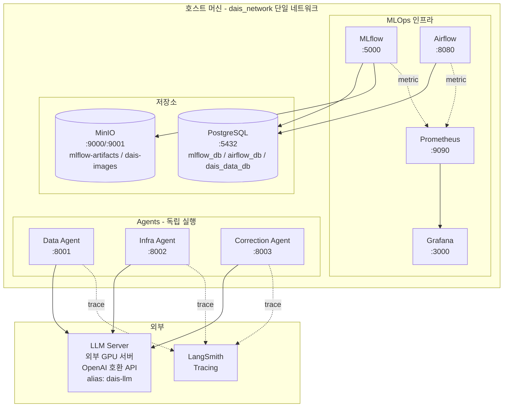

# 시스템 아키텍처

> 본 문서는 골격이다. Phase 진행에 따라 점진적으로 채워진다.

---

## 1. 전체 구성도



---

## 2. 핵심 결정사항

| 항목 | 결정 | 비고 |
|---|---|---|
| Docker Network | 단일 network (`dais_network`) | 단순성 우선. 컨테이너 모두 한 네트워크. |
| Compose project name | `dais` (고정) | 폴더명 변경 시 컨테이너/볼륨 충돌 방지 |
| MLflow Artifact Storage | **MinIO** (S3 호환) | 모델 / 산출물 버전 저장 |
| DB | 단일 Postgres 인스턴스, DB만 분리 (`mlflow_db`, `airflow_db`, `dais_data_db`) | `dais_data_db` 는 웹 대시보드 케이스/이미지/추론 메타데이터 (docs/IMAGE_STORAGE_REPORT.md) |
| 운영 이미지 스토리지 | MinIO bucket 분리 (`mlflow-artifacts` ↔ `dais-images`) | MLflow 산출물과 운영 이미지(원본/heatmap/annotation) 분리 |
| Agent 간 통신 | **없음** (각 Agent 독립 실행) | 각 Agent 는 자체 진입점, 단순한 의존 그래프 |
| Agent Tracing | LangSmith | `LANGCHAIN_*` env 만 설정하면 자동 활성화 |
| LLM | 외부 GPU 서버 vLLM — `Qwen/Qwen3.6-35B-A3B-FP8`, 서빙 alias `dais-llm` | 모델 중립 alias 라 교체 시 클라이언트 수정 불필요. tool calling 실측 검증(`qwen3_coder`). 정의는 `docker/llm-qwen/`, 설정은 루트 `.env` 의 `LLM_*` |
| 학습된 모델 관리 | MLflow Registry + `models:/dais_anomaly/Production` | stage 기반 (alias 마이그레이션 검토 중) |
| GPU 컨테이너 분리 | `ml-train` (profile=train) / `ml-inference` (profile=ml) | `make up` 시 안 띄움 — GPU 자원 절약 |
| 인프라 폴더명 | `docker/` | 도커 중심 구조 강조 |
| ML 코드 폴더명 | `model/` | 학습/추론 코드 + weights 한 도메인 |
| 모델 가중치 위치 | `model/weights/` (gitignore) | git X — MLflow + MinIO 가 진실의 원천 |
| 데이터 위치 | `data/` (gitignore, README/구조만 추적) | 운영 단계 MinIO 마이그레이션 검토 가능 |

> 결정이 추가/변경되면 본 표를 먼저 갱신한 뒤 코드 변경. 협업 규칙은 [CONTRIBUTING.md](CONTRIBUTING.md) "1. 작업 규칙".

---

## 3. 데이터 흐름 (Phase 3 이후 상세화)

### 학습 흐름
```
Airflow DAG (train_pipeline)
  → model/train 스크립트 실행
  → MLflow Tracking 으로 metric/param/model 기록
  → MinIO 에 artifact 업로드
  → MLflow Model Registry 등록
  → (조건부) Production stage 승격
```

### 추론 흐름
```
Airflow DAG (inference_pipeline)
  → MLflow Registry 에서 Production 모델 로드
  → 추론 실행
  → 결과 저장 (TBD)
```

### Agent 동작 (Phase 4 이후 상세화)
- 각 Agent는 FastAPI 엔드포인트로 외부 트리거를 받는다.
- LangGraph 그래프 내부에서 Tool을 호출하여 작업 수행.
- LLM 호출은 모두 `agents/common/llm_client.py` factory를 통과.
- 모든 Agent 호출은 LangSmith에 trace 기록.

---

## 4. 관측성 (Observability)

| 계층 | 도구 | 비고 |
|---|---|---|
| 메트릭 | Prometheus → Grafana | 컨테이너/시스템 메트릭 |
| 로그 | Docker logs (Phase 2) | 추후 Loki 검토 가능 |
| Agent Trace | LangSmith | LLM 호출 추적 |
| MLflow Run | MLflow UI | 실험/모델 추적 |

---

## 5. TODO (Phase 진행에 따라 갱신)

- [ ] Phase 2 완료 시: 실제 컨테이너/볼륨 매핑 도식 추가
- [ ] Phase 3 완료 시: 학습/추론 흐름 시퀀스 다이어그램 추가
- [ ] Phase 4 완료 시: Agent 환경의 의존성 그래프 추가
